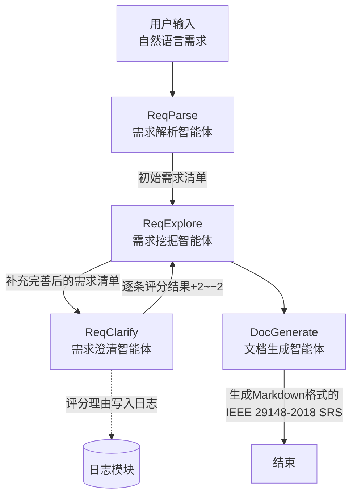

## 多智能体系统开发需求说明

### 一、系统目标

基于大语言模型构建四个协作智能体，实现从自然语言需求到符合 **IEEE 29148-2018** 标准的 SRS 文档自动生成与迭代优化。

---

### 二、智能体开发需求

#### 1. ReqParse —— 需求解析智能体

**目标**：将用户自然语言需求转化为结构化需求要点。
**输入**：自然语言需求描述。
**输出**：初始需求清单（功能需求、非功能需求、约束条件）。
**开发要求**：

* 使用LLM完成需求抽取与分类；
* 输出结构化JSON数据；
* 不生成假设性内容。

---

#### 2. ReqExplore —— 需求挖掘智能体

**目标**：在初始需求基础上进行补全、细化与优化。
**输入**：上一轮需求清单 + `ReqClarify` 输出的逐条评分结果。
**输出**：更新后的需求清单。
**开发要求**：

* 根据评分自动执行调整：

  * **+2（强采纳）**：保持原需求；
  * **+1（采纳）**：轻微优化表述；
  * **0（中性意见）**：保持或进行泛化；
  * **−1（不采纳）**：重新表述该需求；
  * **−2（强不采纳）**：删除或生成替代需求；
* 输出操作日志（保留/修改/删除/新增）；
* 不依赖文本型澄清意见，仅使用数值评分。

---

#### 3. ReqClarify —— 需求澄清智能体

**目标**：模拟用户角色，对生成的每条需求进行定量评分。
**输入**：生成的需求清单 + 基准SRS文档。
**输出**：逐条评分结果（5分制枚举值）。
**开发要求**：

* 采用 **5分制枚举评分体系**：

  * **+2：强采纳（完全符合）**
  * **+1：采纳（基本符合）**
  * **0：中性意见（无明确倾向或不涉及）**
  * **−1：不采纳（部分错误或遗漏）**
  * **−2：强不采纳（严重偏离或错误）**
* 输出格式（JSON数组）：

  ```json
  [
    {"id":"FR-01","score":2},
    {"id":"FR-02","score":-1},
    {"id":"FR-03","score":0}
  ]
  ```
* 评分理由与修改方向仅写入日志模块，不返回系统。

---

#### 4. DocGenerate —— 文档生成智能体

**目标**：根据最终优化的需求清单生成符合 IEEE 29148-2018 标准的的正式SRS文档。
**输入**：最终需求清单。
**输出**：**Markdown格式**的SRS文档。
**开发要求**：

* 输出章节化结构。
* 输出专注于内容与格式规范化。
* 内容必须来自需求清单。
* 不要假设不存在的需求。

---

### 三、系统约束

* `ReqClarify` 输出逐条评分（+2 至 −2），不提供文字反馈；
* `ReqExplore` 仅根据数值评分自动调整需求；
* 系统支持多轮迭代（1–5轮），以评分收敛为停止条件；
* 所有评分理由与变更记录写入日志模块。

---

### 四、系统流程图



---

### 五、系统特性总结

* **定量驱动**：澄清模块以 5分制评分作为核心反馈信号。
* **迭代优化**：挖掘模块基于逐条评分实现自动修正。
* **职责清晰**：文档生成模块仅负责输出，不再参与需求修订。
* **可验证性**：评分记录与版本日志支撑定量实验与复现。

---